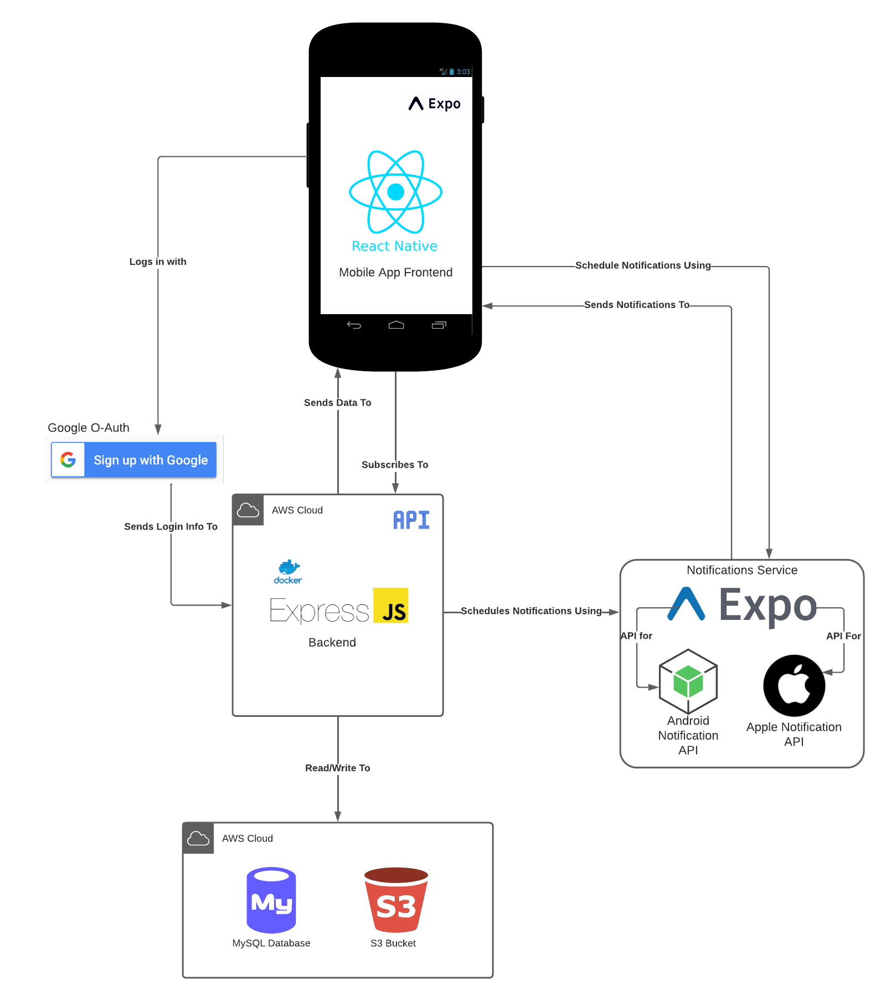

# CareTechers Project - CareCoord

[Design Doc](https://docs.google.com/document/d/11AryL_tiAmfCnCueabXaWSxNrXtjPkBVMe-r-hu-zhQ/edit?usp=sharing)

## Description

As we age, caring for elderly loved ones becomes an inevitable reality. However, juggling caretaking responsibilities with multiple caregivers can be challenging and even result in missed visits or tasks that are crucial for the well-being of our loved ones. To alleviate these concerns, we are proud to introduce CareCoord, a mobile application designed to simplify shared caretaking. CareCoord offers five core services to make caretaking a seamless and stress-free experience. With notes and a group messaging system, users can easily store and share important information, preventing crucial caretaking information from being overlooked. Additionally, the calendar and scheduling system allow caretaking groups to organize and track visits, protecting elderly loved ones from the dangers of long periods of time without a check up. CareCoord also helps users monitor critical health information, such as blood pressure and heart rate, making it easy to recognize any health changes. Lastly, to-do lists and reminders keep caretakers on track, making sure they are providing the care their loved ones need.

## Platforms/Architecture

CareCoord consists of two main components - a mobile frontend built using [React Native](https://reactnative.dev/) & a backend built
using [Express.js](https://expressjs.com/), a web framework for [Node.js](https://nodejs.org/en). Both the backend & frontend are written
in JavaScript. To get the backend and frontend running, see the "Getting Started" section below.

### Architecture Diagram

## Getting started

### Building & Running the Backend API

#### Prerequisites

Before you begin using the app, you'll need to make sure you have the [current version of Node.js](https://nodejs.org/en/download/) installed, as well as [Git](https://git-scm.com/).

#### Step 1: Clone the Repository & Enter the Backend

If you haven't cloned the CareCoord repo, do so now by entering the following command in your terminal:

`git clone https://capstone-cs.eng.utah.edu/caretechers/caretechers.git`

Then, enter the directory that the mobile application's frontend is located in:

`cd caretechers/backend`

#### Step 2: Install dependencies

Again, make sure you have Node.js installed (see Prerequisites section above).

Install dependencies by entering the following command in your terminal:

`npm install`

#### Step 3: Start the backend development server

To start the development server, just type the singular command in your terminal below

`npm start`

Alternatively, you can run `make start` to run the backend server in a docker container.

### Building & Running the Frontend (CareCoord UI)

#### Prerequisites

Before you begin using the app, you'll need to make sure you have the [current version of Node.js](https://nodejs.org/en/download/) installed, as well as [Git](https://git-scm.com/).

You also will need to install the [Expo Go application](https://expo.dev/client) on your mobile device.

#### Step 1: Clone the Repository & Enter the Frontend

If you haven't cloned the CareCoord repo, do so now by entering the following command in your terminal:

`git clone https://capstone-cs.eng.utah.edu/caretechers/caretechers.git`

Then, enter the directory that the mobile application's frontend is located in:

`cd caretechers/Frontend`

#### Step 2: Install dependencies

Again, make sure you have Node.js installed (see Prerequisites section above).

Install dependencies by entering the following command in your terminal:

`npm install`

#### Step 3: Login to Expo

In order for the Google Auth to work in CareCoord, you must log in to expo in your terminal (make sure you
are in the Frontend directory) by entering this command:

`npx expo login`

Email/Username: `caretecher`

Password: `4$CareTechers`

Once you have logged in, Google Auth should work.

#### Step 4: Start the UI development server

To start the development server, just type the singular command in your terminal below

`npm start`

This will generate a QR code that you can scan using the iOS camera app. Assuming you have installed
the Expo Go app on your iPhone, the UI should automatically load once the QR Code is scanned.

Note: These instructions are specifically for iPhone users, as this project is tailored for the iPhone. Instructions may
differ for Android users. If you are an Android user, we recommend visiting [these React Native docs](https://reactnative.dev/docs/environment-setup) for more information.

#### Optional - Configuring backend address

If you want the frontend to use your locally-running backend, navigate to the `config.js` file in the `Frontend/constants/` directory.
Then, set the value of the `local_ip` variable to be your computer's IP address. Then, change the value of `ip` to be equal to `local_ip`
rather than `aws_ip`.

## Deployment

Our backend is dockerized and deployed to an AWS EC2 instance. We also use AWS RDS and S3 for data storage.

Since the AWS console frequently changes, we believe it would be best to post articles dictating how to create/manage
these AWS services:

[AWS EC2 Instance](https://docs.aws.amazon.com/AWSEC2/latest/UserGuide/EC2_GetStarted.html)

[AWS RDS - Creation](https://docs.aws.amazon.com/AmazonRDS/latest/UserGuide/CHAP_RDS_Configuring.html)

[AWS RDS - Management](https://docs.aws.amazon.com/AmazonRDS/latest/UserGuide/CHAP_RDS_Managing.html)

[AWS S3 - Setup](https://docs.aws.amazon.com/AmazonS3/latest/userguide/GetStartedWithS3.html)

As long as the EC2 instance is up and healthy, the backend should automatically be deployed and reachable
after code is merged into main (through a CI/CD pipeline).

## Support

If you have any questions or concerns, please email caretechers4@gmail.com

## Authors and acknowledgment

Aaron Heo, Benjamin Hatch, Brynnli Borrowman & Seng Rith

## Project status

Final Release
